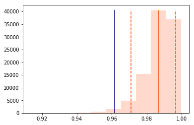
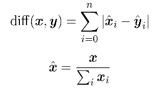
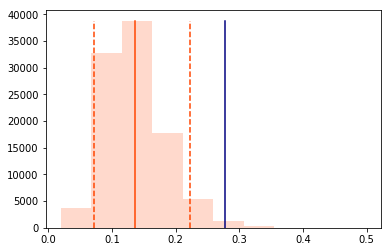
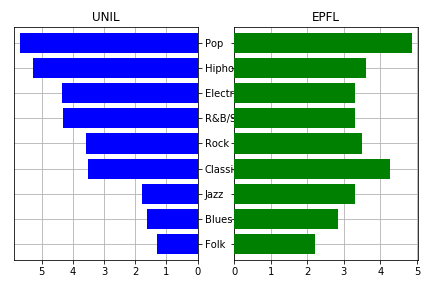
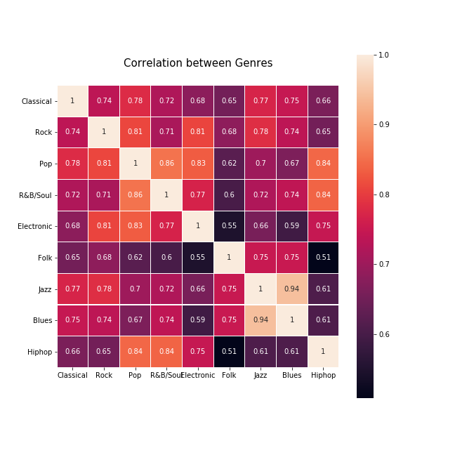
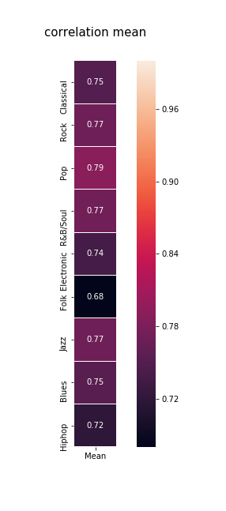
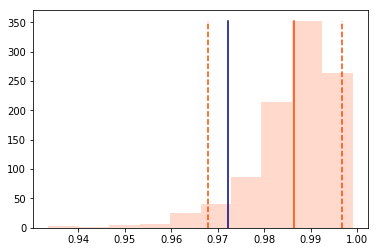
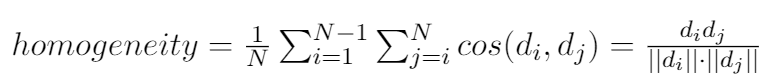
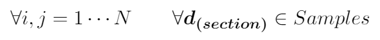

# Preparation for next milestone

We had to set up an Overleaf document in order to prepare for next milestone, and here is the (read-only) link: https://www.overleaf.com/read/qbsypjcwwrcp

# Recap of last milestone

As a recap, milestone 3 was about setting up the survey and deploying it, as well as preparing the tools we would use to do analysis on the data. In the survey we had a list of genre, and we asked people to give a score to each one of them, from 0 to 10, according to how often they listen to this kind of music. The proportion is what interested us at first, but an absolute reference would have also been welcome, so we added a question asking to how many hours of music the people listen to per week. That way, the idea would be to combine the absolute value with the proportion of each genre to have a rough estimate of how many hours per week people listen to the different genres.

# Precision of Research Question

After minestrone 3 and after having been able to observe the first results of our survey we stopped to look at the exact questions of our research. 

The questions are therefore as follows:

- Is there a significant difference between the musical genres listened to by students in different fields of study?
- Do students in technical fields have different listening habits than students in other university fields? (listening time, gender, absolute listening genre)

We imagine that study field could possibly influence on music taste like level of degrees or social background influence it. 

After having finished our research it is time to take a critical look at its functioning in terms of representativeness of the sample, number and understanding of the survey. 

We wanted to gather a sample as diverse as possible in terms of field of study so that it would be as close as possible to reality.

One of our concerns has been to avoid the "simplest" solutions in our situation to find participants. Indeed, UNIL and EPFL allow a test to be carried out by email (which often happens to be the best way to approach the desired audience), unfortunately, the two universities now only allow sending it to people who come from the researcher's main field of study. The field of study being that of digital humanities, it is precisely at the crossroads of technical studies and humanities studies. A sample composed mainly of students in digital humanities would have been a starting bias.  Despite a somewhat limited sample, we have some diversity of the fields of study. 

To speak about the understanding of the survey, the question at the heart of it, namely the one on the appreciation of musical genres, was represented by a rating scale of 11 points (0 to 10) which represented the appreciation of genres. 0 represented a zero listening and 10 corresponded to a genre that was listened to in majority.

Although the pre-tests did not show any significant difficulty in interpretation, we think that a cursor might have been preferable for three reasons:

The first is that it would not have been necessary to scroll to see all the possibilities of the scale (which some users had to do), especially on the mobile version.

Another reason is that students took different strategies to evaluate their genre preferences: few ranked the genres using different a rank for each genre, while most used an absolute scale, for instance, putting a rank of 9 for four different genres, which they are presumably equally enthusiastic about. A cursor would likely not prompt the former approach.

The third reason is that the use of a cursor could have provided a more spontaneous and thus more accurate result.

# Gathered data

The survey was put online on April 17th and quickly got around 20 responses. The survey is open until now, and we now have a total of 62 answers. Taking a look at the data, we quickly realised that there were some problematic answers. For example, one of the response put 99 as the age, every genre to 10, and a weekly total of 100 hours. Another answer clearly was in this same case. This kind of data seems to be misleading and it is uncertain that it means anything so it was removed from the results. Another answer did not check the “I agree that my data is used for university research” so it was also removed in order to respect the wish (although it is questionable that somebody took the time to answer what clearly was purposed for research, only to not agree on sharing their answers). Thus the total number of data points reached 59. 

# Cleaning data

When exporting Google form answers to an Excel format, there is one column per question. The way our survey was designed is that it first asked for the university to which the subject belongs, and then asking their degree and section. As the list of section is rather long, the form was split after the question about the university, and according to the answer, we get a different page, with specified sections (for example, if somebody checked that they study at EPFL, then the section options only lists EPFL sections). This meant that the Excel answer file has several time the same question (like the question about section), and for people at EPFL, one column is always empty, and for people at UNIL, the other column is always empty. 

In order to reduce even more the size of each list of sections, we asked for the school, which is a more general category of each sections (for example, Computer Science belongs to the School of Computer Sciences and Communications, which also contains Communications Systems, Data Science and Cyber Security). Thus the form went as follows: “Which university do you study at ?” and then “What school do you belong to ?”. Having it like that allows to have a rather small list of choices, but it now means that there are even more instances where we have the same question different time in the Excel file. For example, with what was just described, the file columns would be:

- Which university
- Which school (EPFL schools)
- Which section (one column for each school)
- Which school (UNIL schools)
- Which section (one column for each school)

When we prepared code before the data gathering, we had dummy data that could simulate what we would use. This data was the optimal way to consider the results. It simply consisted of a table with columns like “Age”, “Gender”, “Section”, and then all the information of proportion for each genre. The  goal was then to transform the Excel file into a table of this format. 

When a subject answers the survey, it only sees the path corresponding to their university, school and degree. This means the same questions but for the other school are left untouched, and most columns in the resulting Excel file will be empty. This also means that we can concatenate every question about the section together, because only one will be filled, and we will get only one column with just the information we need. Same goes for the school and degree. The data is then exactly how we wanted it to be. In the code, using Pandas, this is what we get if we call the dtypes function on the data frame (we can see every column along with their representation):

```
Age              int64
Gender        category
Classical        int64
Rock             int64
Pop              int64
R&B/Soul         int64
Electronic       int64
Folk             int64
Jazz             int64
Blues            int64
Hiphop           int64
Total          float64
School        category
Section       category
Degree        category
Major         category
```

The code for the cleaning part can be found in cleaner.ipynb.

# Presenting the data

Here we show the number of answers for each school:

| School                                                               | Number of answers |
|----------------------------------------------------------------------|-------------------|
| College of Humanities (CDH)                                          |         3         |
| College of Management of Technology (CDM)                            |         1         |
| Faculté de biologie et de médecine                                   |         5         |
| Faculté de droit, de sciences criminelles, d’administration publique |         2         |
| Faculté des géosciences de l’environnement                           |         3         |
| Faculté des hautes études commerciales                               |         7         |
| Faculté des lettres                                                  |         6         |
| Faculté des sciences sociales et sciences politiques                 |         6         |
| School of Architecture, Civil and Environmental Engineering (ENAC)   |         7         |
| School of Basic Sciences (SB)                                        |         5         |
| School of Computer and Communication Sciences (IC)                   |         5         |
| School of Engineering (STI)                                          |         9         |


These number are fairly balanced, the School of Engineering is the one where we got the most results. This higher number will be used as a way to split the population between people in STI and the others.

Here is a simple analysis of the data (using Pandas function describe on the data frame):


|       | Age   | Classical | Rock | Pop  | R&B/Soul | Electronic | Folk | Jazz | Blues | Hiphop | Total | 
|-------|-------|-----------|------|------|----------|------------|------|------|-------|--------|-------|
| count | 59    | 59        | 59   | 59   | 59       | 59         | 59   | 59   | 59    | 59     | 59    | 
| mean  | 23.23 | 3.86      | 3.55 | 5.37 | 3.86     | 3.89       | 1.77 | 2.55 | 2.25  | 4.28   | 13.34 | 
| std   | 2.75  | 2.92      | 3.07 | 3.25 | 3.25     | 3.14       | 2.37 | 2.86 | 2.66  | 3.63   | 13.23 | 
| min   | 18    | 0         | 0    | 0    | 0        | 0          | 0    | 0    | 0     | 0      | 0.5   | 
| 25%   | 22    | 1         | 0.5  | 3    | 1        | 1          | 0    | 0    | 0     | 1      | 5     |
| 50%   | 23    | 4         | 3    | 5    | 4        | 3          | 1    | 1    | 1     | 3      | 10    |
| 75%   | 25    | 6.5       | 6    | 8    | 6        | 6          | 3    | 4    | 4     | 8      | 18    |
| max   | 31    | 10        | 10   | 10   | 10       | 10         | 9    | 10   | 10    | 10     | 80    |


We can see that the most listened genre is Pop with a mean of 5.37 on the 0-10 scale, the least listened one being Folk with a mean of 1.77. Hip-hop can be seen as the most controversial genre out of the ones here, because its standard deviation is the highest, meaning there is a higher change between different people, roughly speaking, – people either love it or hate it.

A deeper analysis of the results will now be presented.

# Analysis and results

## 1. EPFL vs. UNIL

As a first deeper analysis, it was interesting to compare the result of people from EPFL to people from UNIL. The first very vague idea is to compute the mean of preferences of each group. Here are the values:


| University | Classical | Rock | Pop  | R&B/Soul | Electronic | Folk | Jazz | Blues | Hiphop |
|------------|-----------|------|------|----------|------------|------|------|-------|--------|
| EPFL       | 4.06      | 3.32 | 4.77 | 3.19     | 3.22       | 2.12 | 3.22 | 2.70  | 3.45   |
| UNIL       | 3.62      | 3.68 | 5.89 | 4.44     | 4.48       | 1.34 | 1.82 | 1.68  | 5.10   |


The need of comparing those two vectors is what motivates the next part. We can draw naive conclusion from this data, namely, we see that people from UNIL tend to listen to more Hip-hop than people from EPFL. This result cannot be classified as more than an interpretation, and it would desirable to have a value that states how close or far the values are. We could compute a simple correlation term or a cosine similarity in order to have a metric regarding how alike the preferences are. This is better than before but still, having only one value does not allow us to conclude anything.

Technically, we would like to have an hypothesis that we could confirm or reject depending on our data. The 2-sample bootstrap method is what we need here. As a quick heads up, this method allow us to have a statistical reference when comparing two distributions, meaning its result may indicate that 2 samples from 2 population are different, statistically speaking. A more detailed explanation of the method can be found in  the previous milestone or in [1]. 

We start with a null-hypothesis being "People from EPFL and people from UNIL have the same musical preferences". The bootstrap method get used (using cosine similarity as metric), and here is the resulting plot:



The blue line here is the original similarity of the EPFL vector and the UNIL vector. Then we proceed with 100000 samples, and get a distribution of similarities, that are represented in the plot by the orange distribution. The orange plain line is the mean of the samples' similarities, and the dashed orange lines are the 5 percentile and 95 percentile of the same data. The bootstrap method indicates us that if the original similarity score lies outside of the confidence interval between the two dashed lines, then we can reject the null-hypothesis. Here, it is the case, so rejecting the hypothesis means that we can conclude that people from EPFL and people from UNIL statistically have different listening habits.

To verify the result, we can redo exactly this using another metric, namely the absolute difference metric. It is defined as such:



Note that this metric gives a value of 0 if two vectors are the same (in contrast with the cosine similarity which gives 1). If we apply the bootstrap method once again, we get this result, which confirms the conclusion just above:



The chart below shows the means of different genres in the both universities. We can see that EPFL students have larger preferences to jazz, blues and folk music, and also prefer hip-hop music less.



The explanation for such situation with hip-hop could lie in the linguistic organization of two campuses. While EPFL is more international with English veing a prominent language, UNIL is clearly dominated by French language and thus culture. French rap has become a rather high-profile and very mainstream within last 2-3 years, so it is possible that predominantely French-speaking students of UNIL would listen to it more.


## Relations between genres

To find a relationship between genres, correlation between them was computed. From the obtained result, it is evident that that jazz and blues have a very strong correlation value, which indicates that people who listen to jazz with a very high probability will also enjoy blues, and the time they spend on these 2 types will be similar as well.

We also noticed that the correlations between folk music and hip-hop, as well as folk music and electronic, are lower than average. Hence, these two genres can be interpreted as contrasting. The preference for folk is independent of hip-hop and Electronic music.


|         Correlations            |           Mean
| :------------------------------:|:--------------------------:
|  |  

Computing the means of correlations with other genres for each separate genre, demonstrates that in general, people's preference for folk music in general has little to do with their preference for other genres.


## Differences depending the field of study

Next step is the examination of musical preferences depending on the kinds of studies. For this part, it appeared reasonable to group some closely related fields across UNIL and EPFL together to get a more statistically balanced representation, considering the fact that some sections had very few data points. Sections with a larger number of responses were kept separate. Additionally, these groups were combined into 2 macrogroups - STEM and Business&Humanities, similarly to what has been done in one comparative study on musical tastes of Chinese and American students [2].

College of Digital Humanities (CHD), being on the edge between the two, could stand separately as it is difficult to classify as belonging to one group or another. However, due to the low number of responses and considering that students mostly come from computer science and engineering background, it was grouped together with the IC department (School of Computer and Communication Sciences). The grouping is as follows:


|        Macrogroup       |         Group         |        Section      |  Number of students |
|:-----------------------:|:----------------------|--------------------:|--------------------:|
|       **STEM**          |        Sciences       | SB\* (EPFL)         | 10                  |
|                         |                       | FBM\* (Unil)        |                     |
|                         |   Informatics (EPFL)  | IC\*                | 8                   |
|                         |                       | CDH\*               |                     |
|                         |      ENAC\* (EPFL)    |                     | 8                   |
|                         |       STI\* (EPFL)    |                     | 9                   |
| **Business&Humanities** | Social Studies (Unil) | SSP\*               | 11                  |
|                         |                       | FDCA\*              |                     |
|                         |                       | GSE\*               |                     |
|                         |       Economics       | CDM\* (EPFL)        | 8                   |
|                         |                       | HEC\* (Unil)        |                     |
|                         |       Arts (Unil)     | Faculté des lettres | 6                   |


We compare the preferences between the macrogroups by applying the same cosine difference and validating through the bootstraping method as we did before to compare between the universities.



As we can see, the difference between the two major macrogroups is by far not as significant the difference between the two universities, meaning that the campus environment could be more decisive for the tastes. However, there are still notable differences if we look into finer distinction between the study groups.

### Homogeneity

We define *homogeneity* as the average of pairwise cosine similarities within a set ***d*** of preference vectors that correspond to a certain section:


With this measure we can see in which fields of study the tastes are the most aligned.

Interestingly, the section that is the most dissimilar to the others, which is School of Engineering (STI), turned out to also be the most heterogeneous. This is also visible in how none of the genres has a huge advantage over the others for this section with maximum "popularity" (mean) at just 3.67 for classical music. In contrast, the most uniform in its tastes compared to the rest, is Faculty of Arts ("lettres") with homogeneity coefficient of 0.81, followed by School of Architecture, Civil and Environmental Engineering (ENAC).

|#|Section|Homogeneity
|:----:|:----:|:----:|
|1|	Arts |0.813209
|2|	ENAC	|0.712033
|3|	Social studies	|0.709120
|4|	Economics	|0.655249
|5|	Informatics	|0.633463
|6|	Sciences	|0.625581
|7|	Engineering (STI)	|0.554028

Comparing globally, UNIL is just insignificantly more homogeneous compared  to EPFL.

| **Unil** | **EPFL** |
|:--------:|:--------:|
| 0.693556 | 0.632053 |

More noticeably, business and humanities students have relatively more homogeneous tastes compared to STEM students.

|**Business&Humanities**|**STEM**|
|:---------------------:|:------:|
|        0.710582       |0.632053|


# References

[1] _Two-sample bootstrap tests: When to mix?_ Subhash Lele, Ed Carlstein

[2] _Globalization of Millennials’ Music Consumption: A cross-national music taste study of undergraduate students in China and the U.S._ Yifan Xu
